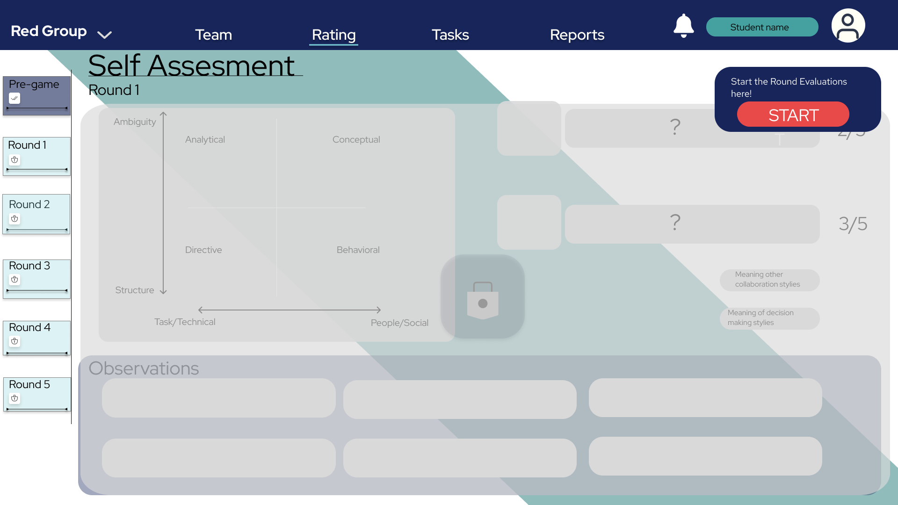
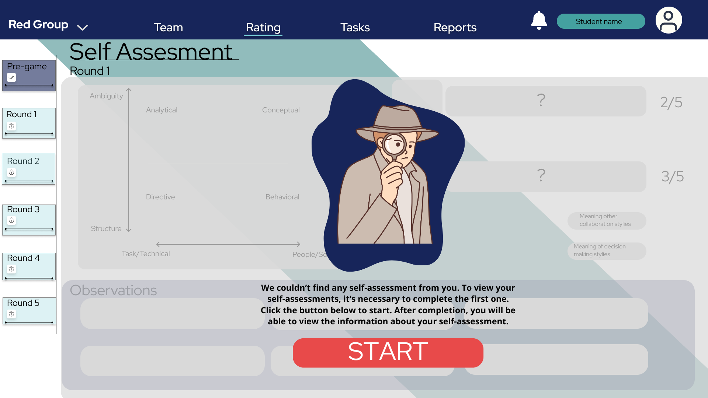

# Ponderada de UX - Sexta Semana

Este repositório é dedicado à atividade avaliativa "Antes x Depois - Usabilidade e Acessibilidade", correspondente à sexta semana da terceira sprint do módulo 2 do [Inteli - Instituto de Tecnologia e Liderança](https://www.inteli.edu.br/). O foco desta atividade é a Experiência do Usuário (UX). Neste contexto, propomos melhorias na usabilidade da tela de autoavaliação do nosso projeto, Zuyd Connection.

**Projeto:** Zuyd Connection é uma aplicação web projetada para melhorar a comunicação e colaboração entre indivíduos de diferentes culturas. O projeto visa amenizar mal-entendidos e promover uma maior compreensão e colaboração entre usuários de diferentes culturas.

**Tela:** A tela de autoavaliação permite que os usuários visualizem os resultados de suas avaliações. No entanto, para aqueles que ainda não completaram nenhuma avaliação, a usabilidade atual é limitada e pode levar a uma experiência de usuário frustrante e confusa. Nesse caso, as informações não são exibidas e, em vez disso, um grande retângulo com um ícone de cadeado é mostrado, cobrindo quase toda a tela.

Abaixo, apresentamos a imagem da tela atual:

Figura 01 - Imagem Atual da Tela de Autoavaliação
 
 

 
 
Fonte: Material produzido pelos autores (2024)

## 1. Critérios de Avaliação e Avaliação da Tela Atual

Os critérios de avaliação são baseados em três aspectos principais da usabilidade:

**Clareza:** Refere-se à facilidade com que o usuário pode entender o propósito e a funcionalidade da tela. Uma tela clara tem instruções intuitivas e informações facilmente acessíveis.

**Navegabilidade:** Refere-se à facilidade com que o usuário pode navegar pela tela e realizar as ações desejadas. Uma boa navegabilidade significa que os elementos interativos estão bem posicionados e claramente identificados.

**Feedback Visual:** Refere-se à maneira como a tela comunica o estado atual e as possíveis ações ao usuário. Um bom feedback visual fornece indicações claras e imediatas sobre o que está acontecendo e o que o usuário pode fazer a seguir.

### Avaliando a tela atual com base nesses critérios:

- **Clareza:** A tela atual carece de informações claras, deixando os usuários sem entender por que não conseguem acessar os resultados. A falta de instruções claras e a presença de um ícone de cadeado sem texto explicativo podem confundir os usuários, especialmente aqueles que estão usando a plataforma pela primeira vez.

- **Navegabilidade:** O botão para iniciar a autoavaliação está mal posicionado, dificultando a interação intuitiva do usuário. Ele está localizado no canto superior direito da tela, próximo ao ícone de notificações, o que pode não ser imediatamente óbvio para os usuários.

- **Feedback Visual:** A ausência de um texto explicativo junto ao ícone de cadeado não fornece um feedback visual adequado sobre as ações necessárias. Isso pode deixar os usuários incertos sobre o que o ícone de cadeado significa e o que eles precisam fazer para desbloquear a tela.

Essas questões podem levar a uma experiência de usuário frustrante e confusa, o que pode desencorajar os usuários a completar suas autoavaliações.

## 2. Descrição das Mudanças Propostas

Com base na avaliação da tela atual, propomos algumas mudanças para melhorar a usabilidade. Abaixo, apresentamos a imagem da tela com as mudanças propostas:

Figura 02 - Imagem das Melhorias Propostas na Tela de Autoavaliação
 
 

 
 
Fonte: Material produzido pelos autores (2024)

**Botão Centralizado:** O botão 'START' foi centralizado e aumentado, o tornando o foco visual da tela e facilitando o clique. Isso foi feito para melhorar a navegabilidade e tornar mais intuitivo para o usuário onde clicar para iniciar a autoavaliação.

**Texto Explicativo:** Adicionamos um texto explicativo acima do botão, orientando o usuário sobre a necessidade de completar a primeira autoavaliação para acessar os resultados. Isso aumenta a clareza e fornece um feedback visual útil para o usuário.

**Imagem Ilustrativa:** Incluímos uma imagem de um detetive para representar visualmente a busca pelas autoavaliações do usuário. Isso adiciona um elemento visual amigável que pode tornar a experiência do usuário mais agradável e menos frustrante.

## 3. Melhorias na Usabilidade

**Intuitividade:** O botão maior e centralizado, junto com o texto explicativo, torna imediatamente claro para o usuário o que precisa ser feito. Isso ajuda a orientar os usuários, especialmente aqueles que estão usando a plataforma pela primeira vez.

**Orientação ao Usuário:** O texto fornece as informações necessárias para que o usuário entenda por que não pode ver suas autoavaliações e como proceder. Isso ajuda a esclarecer o propósito de realizar a sua primeira autoavaliação e orienta os usuários sobre as ações necessárias para desbloquear a tela.

**Estética Agradável:** A imagem do detetive adiciona um elemento visual amigável que representa a busca frustrada por uma autoavaliação, o que pode tornar a experiência do usuário mais agradável e menos frustrante. Isso pode ajudar a aliviar a frustração dos usuários ao se depararem com uma tela bloqueada e incentivar a interação com a plataforma.

Acreditamos que essas mudanças melhoram significativamente a usabilidade da tela de autoavaliação, a tornando mais intuitiva e amigável para o usuário.

As mudanças propostas visam tornar a interface mais amigável e intuitiva, reduzindo a confusão e melhorando a experiência geral do usuário na aplicação Zuyd Connection. Acreditamos que essas melhorias são possíveis de serem implementadas no projeto e serão apresentadas ao grupo para consideração. Esperamos que essas mudanças facilitem a interação do usuário com a plataforma, incentivem a realização das autoavaliações e, consequentemente, promovam uma maior compreensão e colaboração entre indivíduos de diferentes culturas.
